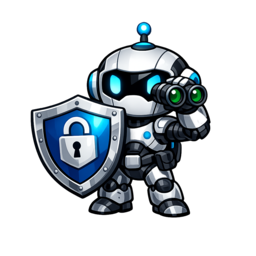

<p align="center">
  
</p>

<h1 align="center">Vexscan for Claude Code</h1>

<p align="center">
  <strong>Don't let malicious plugins hijack your AI sessions.</strong><br>
  Security scanner that protects Claude Code from untrusted plugins, skills, MCPs, and hooks.
</p>

<p align="center">
  <a href="LICENSE"></a>
  <a href="https://github.com/edimuj/vexscan-claude-code/releases"></a>
</p>

---

## Why?

Claude Code's plugin ecosystem is powerful — but with great power comes great risk. A malicious plugin can:

- **Steal credentials** from your environment (API keys, SSH keys, cloud tokens)
- **Exfiltrate data** to external servers via webhooks
- **Inject prompts** that override your instructions
- **Execute arbitrary code** on your machine

Vexscan scans plugins *before* they can do damage, using pattern detection and AI-powered analysis to separate real threats from false positives.

## Quick Start

```bash
# Install from marketplace
/plugin marketplace add edimuj/vexscan-claude-code
/plugin install vexscan
```

That's it. Vexscan now scans your plugins automatically on every session start. AI analysis runs through your existing Claude Code subscription — no extra API keys or costs.

## What You'll See

On session start, Vexscan runs in the background and alerts you if it finds anything:

```
SECURITY ALERT: Found 2 critical, 5 high, 3 medium issue(s) in plugins/skills.
Run /vexscan:scan for AI-powered analysis.
```

## Commands

| Command | Description |
|---------|-------------|
| `/vexscan:scan` | Scan all plugins with AI-powered analysis |
| `/vexscan:scan <path>` | Scan a specific directory |
| `/vexscan:vet <url>` | Vet a plugin *before* installing |

### Example: Vetting Before Install

```bash
/vexscan:vet https://github.com/someone/cool-plugin
```

Get a verdict (SAFE / CAUTION / RISKY / DANGEROUS) before you install anything.

## Detection Coverage

| Category | What It Catches |
|----------|-----------------|
| Code Execution | `eval()`, `new Function()`, `exec()` |
| Shell Injection | `child_process`, subprocess calls, command injection |
| Data Exfiltration | Discord webhooks, external POST requests, fetch to unknown hosts |
| Credential Theft | SSH keys, AWS credentials, `.env` files, API tokens |
| Prompt Injection | System prompt overrides, instruction hijacking |
| Obfuscation | Base64/hex/unicode encoding to hide malicious code |

## How It Works

1. **SessionStart hook** triggers automatic scan of `~/.claude`
2. **Vexscan CLI** (Rust) performs fast static analysis + AST parsing
3. **Smart filtering** skips official Anthropic plugins and `node_modules`
4. **AI analysis** uses your existing Claude Code subscription to review findings — no extra API keys needed

## Manual Installation

```bash
git clone https://github.com/edimuj/vexscan-claude-code.git ~/.claude/plugins/vexscan
```

The Vexscan CLI auto-installs on first use. To install manually:

```bash
curl -fsSL https://raw.githubusercontent.com/edimuj/vexscan/main/install.sh | bash
```

## Related

- [Vexscan CLI](https://github.com/edimuj/vexscan) — The core scanner (Rust)
- [Vexscan for OpenClaw](https://www.npmjs.com/package/@exelerus/vexscan-openclaw) — OpenClaw plugin

## License

[Apache 2.0](LICENSE)
